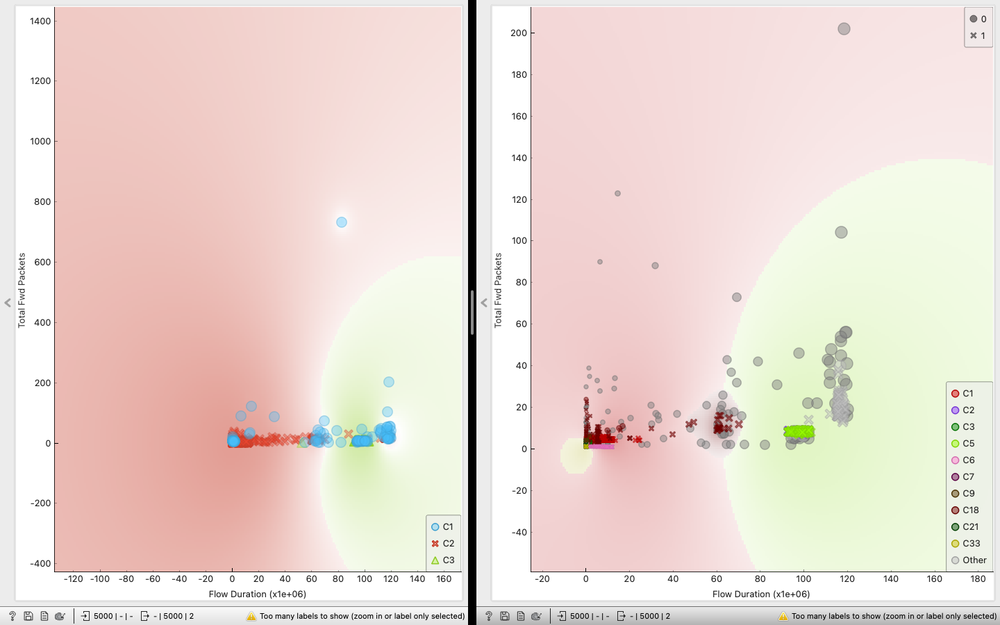

### Extension of LCCDE

by Kyle Berryman, Carson Rivera, Olivia Martinez, Philip Ervin and Samuel Manzanares

Texas State University CS4371.251 Group 2

Original Paper:

L. Yang, A. Shami, G. Stevens, and S. DeRusett, “LCCDE: A Decision-Based Ensemble Framework for Intrusion Detection in The Internet of Vehicles," in 2022 IEEE Global Communications Conference (GLOBECOM), 2022, pp. 1-6.

#### To Run

Requires dependencies in the lccde_extension.ipynb file and the CICID2017 sample dataset provided in the data folder. 

#### Our Contributions

We attempted to improve overall performance by preprocessing the dataset using the density based clustering method DBSCAN instead of the K means method that the authors originally deployed.

We also attempted to replace the CatBoost model in the ensemble because it was the lowest performing for every type of attack.

#### Results

We were unable to increase the returned F1 score of the ensemble method using different models. However, the Light GBM using DBSCAN as a preprocessing method instead of K-Means outperformed the original model for our example dataset. This could potentially be extended for the larger dataset used in the original paper. It should be taken into consideration that we used a sample dataset of the CICID2017 with much less class imbalance than the datset used in the original paper.